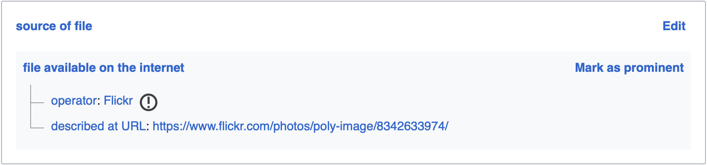

# Duplicate detection

When somebody uses Flickypedia, we want to check for duplicate Flickr pictures which already exist on Wikimedia Commons, and prevent the same file being uploaded twice.

It's unlikely that we can prevent all duplicates, but we can make some best-effort attempts to prevent unnecessary duplication.

One approach to spotting duplicates is to look for the Flickr photo URL in the structured data on existing Wikimedia Commons files ([example](https://commons.wikimedia.org/wiki/File:Gelnhausen,_Kaiserpfalz,_Ruine_des_Palas_%28http---www.flickr.com-photos-poly-image-6318576132-in-set-72157628058920966-%29_%288342633974%29.jpg)):



Unfortunately knowing exactly what value to query for is tricky, because there are a number of forms that a Flickr URL could take in the structured data (e.g. with/without trailing slash, with user slug or numeric ID).

So instead, we use the [snapshots of Wikimedia Commons structured data](https://dumps.wikimedia.org/other/wikibase/commonswiki/).
We download a snapshot, then run a script which looks for instances of this structured data field.
It produces a mapping Flickr ID ↔ Wikimedia Commons file.

1.  Download the latest JSON snapshot from Wikimedia Commons.
    
    This file is large and will take several hours to download.
    This command will download the file, and can resume where you left off if the download is interrupted:
    
    ```
    curl \
      --location \
      --remote-name \
      --continue-at - \
      https://dumps.wikimedia.org/other/wikibase/commonswiki/20231009/commons-20231009-mediainfo.json.bz2    
    ```

2.  Run the script that finds the Flickr IDs in the snapshot:

    ```
    python3 find_flickr_ids_in_sdc_snapshot.py commons-20231009-mediainfo.json.bz2
    ```
    
    This will create a spreadsheet of IDs (`flickr_ids_from_sdc.csv`).
    Even on a fast computer, this may take an hour or so to complete.

    This may also produce two other files:
    
    -   `sdc_errors.txt` – any URLs in the structured data which couldn't be recognised as Flickr URLs
    -   `sdc_warnings.txt` – any Flickr URLs in the structured data which weren't a URL that points to a single photo

---

We use several approaches to detect duplicates in Flickypedia:

1.  We compare the Flickr photo ID to a list of photo IDs which we already know are in Wikimedia Commons
2.  We compute the SHA-1 checksum of 


---

## Creating a Flickr ID ↔ Wikimedia Commons database

Flickr URLs can appear on Wikimedia Commons in many forms, which makes it tricky to query Commons for Flickr files.
(Pending our proposal for a Flickr Photo ID property in Wikidata, which should make this easier once backfilled.)

Instead, we analyse the Wikimedia Commons snapshots to find Flickr URLs and create a SQLite database we can reuse.

1.  Download a snapshot of Wikimedia Commons metadata.

    ```console
    $ curl https://dumps.wikimedia.org/commonswiki/20231001/commonswiki-20231001-pages-articles-multistream.xml.bz2 > commonswiki-20231001-pages-articles-multistream.xml.bz2
    ```

2.  Run the "parse revisions" script.
    This looks for anything that looks like a Flickr URL and adds it to a spreadsheet:

    ```console
    $ python3 parse_revisions_xml.py commonswiki-20231001-pages-articles-multistream.xml.bz2
    ```

3.  aaaa

---

1.  Download a snapshot of Wikimedia Commons structured data:

    ```console
    $ curl https://dumps.wikimedia.org/other/wikibase/commonswiki/20231009/commons-20231009-mediainfo.json.bz2 > commons-20231009-mediainfo.json.bz2
    ```

photo ID
SHA-1 checksum

---

Flickr URLs can appear on Wikimedia Commons in a number of forms, which means there's no easy way to query Commons for Flickr files.
(Pending our proposal for a Flickr Photo ID property.)

Instead, we use the [database dumps][downloads] to construct a local database of Flickr ID ↔ Wikimedia Commons file mapping.

```console
$ curl https://dumps.wikimedia.org/commonswiki/20231001/commonswiki-20231001-pages-articles-multistream.xml.bz2 > commonswiki-20231001-pages-articles-multistream.xml.bz2
```


[downloads]: https://dumps.wikimedia.org/backup-index.html
